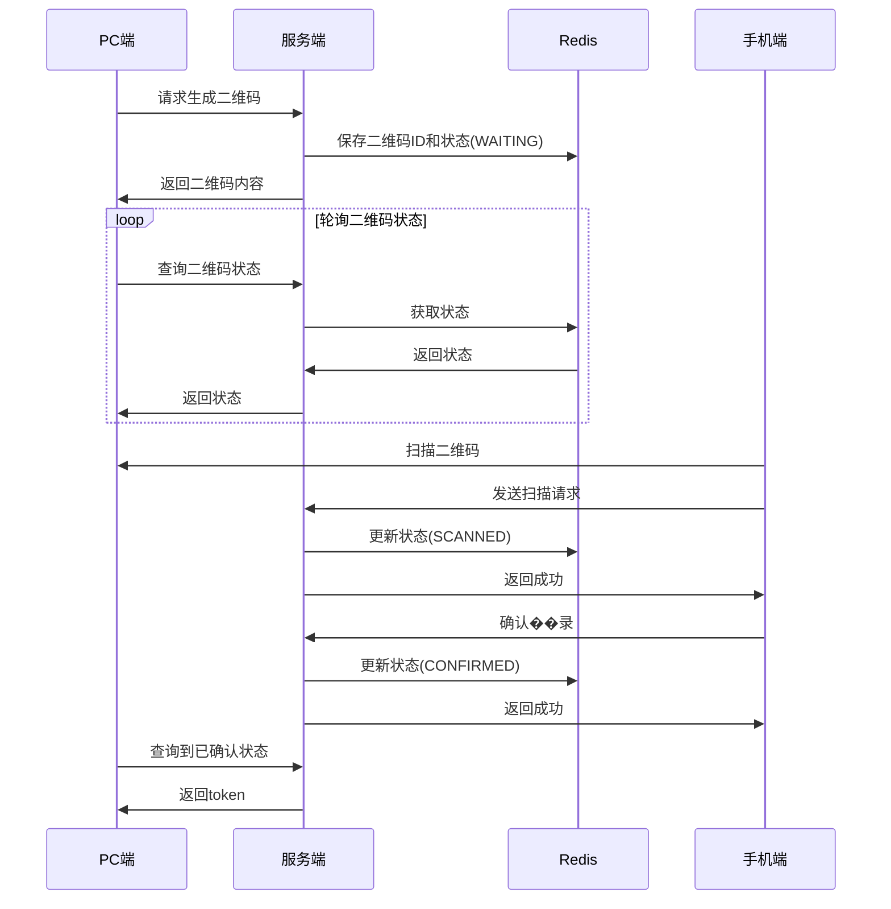

# 二维码扫码登录流程说明

## 1. 整体流程

二维码登录涉及三个角色:
- PC端网页(等待登录的客户端)
- 手机端APP(已登录,用于扫码)
- 服务端(处理登录逻辑)

整体流程如下:
1. PC端向服务端请求生成二维码
2. 服务端生成二维码,并将二维码ID存入Redis
3. PC端展示二维码,并轮询查询二维码状态
4. 手机端扫描二维码,获取二维码ID
5. 手机端携带用户信息确认登录
6. 服务端更新二维码状态
7. PC端轮询到登录成功,获取token完成登录

## 2. 接口说明

### 2.1 生成二维码
- 请求方式: GET
- 请求路径: `/api/qrcode/generate`
- 响应示例:
```json
{
    "code": 0,
    "message": "success",
    "data": {
        "qrcodeId": "550e8400-e29b-41d4-a716-446655440000",
        "qrcodeContent": "http://example.com/qr/550e8400-e29b-41d4-a716-446655440000"
    }
}
```

### 2.2 查询二维码状态
- 请求方式: GET  
- 请求路径: `/api/qrcode/check/{qrcodeId}`
- 响应示例:
```json
{
    "code": 0,
    "message": "success", 
    "data": {
        "status": "WAITING", // WAITING-等待扫码 SCANNED-已扫码 CONFIRMED-已确认 EXPIRED-已过期
        "token": "" // 登录成功时返回token
    }
}
```

### 2.3 扫描二维码
- 请求方式: POST
- 请求路径: `/api/qrcode/scan/{qrcodeId}`
- 请求头: Authorization: Bearer {token} // 手机端用户token
- 响应示例:
```json
{
    "code": 0,
    "message": "success"
}
```

### 2.4 确认登录
- 请求方式: POST
- 请求路径: `/api/qrcode/confirm/{qrcodeId}`
- 请求头: Authorization: Bearer {token} // 手机端用户token
- 响应示例:
```json
{
    "code": 0,
    "message": "success"
}
```

## 3. 时序图



## 4. 安全考虑

1. 二维码有效期
   - 二维码默认5分钟有效期
   - 过期后需要重新生成

2. 防重放攻击
   - 二维码ID使用UUID保证唯一性
   - 确认登录时验证二维码状态

3. 状态控制
   - 使用Redis控制二维码状态
   - 状态转换: WAITING -> SCANNED -> CONFIRMED
   - 不允许跨状态转换

4. 权限验证
   - 手机端确认时需要携带token
   - 验证手机端用户身份

## 5. 注意事项

1. 轮询间隔
   - 建议2秒一次,避免请求过于频繁

2. 异常处理
   - 二维码不存在
   - 二维码已过期
   - 二维码已被使用

3. 日志记录
   - 记录关键操作日志
   - 异常情况记录详细信息

4. 性能优化
   - 使用Redis缓存提高性能
   - 合理设置轮询间隔
   - 及时清理过期数据 